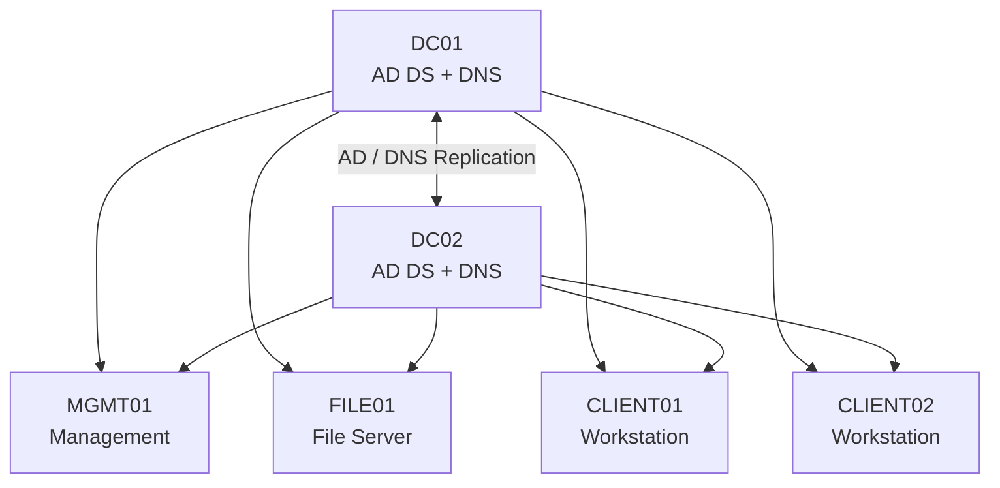

# Project Enterprise Infrastructure

## Network Foundation

| Component | Choice | Why |
|---|---|---|
| Enterprise subnet | 10.10.10.0/24 | Private, simple and 254 addresses available. More than enough for now. Easy to split up later. |
| Subnet mask | 255.255.255.0 | Belongs to /24. |
| Gateway | VMware NAT gateway for now | Gives our machines internet access without already having to build our own firewall/router. |
| DNS | DC01: 10.10.10.10 + DC02: 10.10.10.11 | Our domain clients need to use the internal AD/DNS servers. |
| DHCP | VMware for now | Clients can automatically get addresses. Later we will bring DHCP under our own management. |
| Servers | Static IPs | A DC/fileserver that lives somewhere else every week is bad practice. |
| Clients | DHCP | Like real endpoints. No reason to manually assign IPs to employee PCs. |

## IP Plan

```text
10.10.10.0/24

.1 - .9          Network / gateway / infra-reserve

.10 - .19        Identity & core infrastructure
.10              DC01
.11              DC02

.20 - .39        Servers
.20              FILE01
.21              MGMT01

.40 - .99        Future servers/services

.100 - .199      DHCP clients
                 CLIENT01
                 CLIENT02

.200 - .254      Reserve/lab
```

## Infrastructure Architecture



## IMPORTANT: Before We Start

I took the approach of creating clean virtual machines and cloning them as much as I need for the infrastructure. For example, I have one VM called `WIN-SRV-GOLD` running Windows Server 2025, which I can then clone for DC01, DC02, FILE01, etc. This saves A LOT of time.

However, if you are going to take this approach as well, make sure you generalize your VM BEFORE you clone it.

The reason for this is that every deployed VM should have its own machine-specific identity instead of inheriting everything from the GOLD image.

I learned this the hard way. I cloned my servers without properly generalizing the GOLD image first. DC01 and DC02 ended up with the exact same Machine GUID, and afterwards I was not able to add DC02 as an additional Domain Controller to the existing forest I created with DC01.

To check the Machine GUID, run the following command in PowerShell on your cloned VMs:

```powershell
(Get-ItemProperty 'HKLM:\SOFTWARE\Microsoft\Cryptography').MachineGuid
```

The GUID should be different on every VM.

If your cloned VMs have the same Machine GUID, I recommend deleting the clones and fixing the GOLD VM instead of trying to fix every clone individually.

On the GOLD VM, run:

```powershell
C:\Windows\System32\Sysprep\Sysprep.exe /generalize /oobe /shutdown
```

`/generalize` removes machine-specific information from the Windows installation so the image can safely be used to deploy new machines.

Once Sysprep finishes, the GOLD VM will shut down.

**DO NOT BOOT UP THE GOLD VM AGAIN.**

Keep it powered off and only use it as the source for new clones. When a clone boots for the first time, Windows will go through its setup process and generate its own machine-specific identity.

After creating a new clone, you can run the Machine GUID command again to verify that every VM has a unique GUID.

---

## Configure DC01

1. Set a hostname (`DC01`)
2. Configure static IPv4 address (`10.10.10.10/24`)
3. Install AD DS role
4. Promote the server to a Domain Controller
5. Create a new forest (`corp.forgeline.test`)
6. Set up a strong password for DSRM. Don't store it in the repo.

```powershell
# Windows PowerShell script for AD DS Deployment

Import-Module ADDSDeployment

Install-ADDSForest `
-CreateDnsDelegation:$false `
-DatabasePath "C:\WINDOWS\NTDS" `
-DomainMode "Win2025" `
-DomainName "corp.forgeline.test" `
-DomainNetbiosName "FORGELINE" `
-ForestMode "Win2025" `
-InstallDns:$true `
-LogPath "C:\WINDOWS\NTDS" `
-NoRebootOnCompletion:$false `
-SysvolPath "C:\WINDOWS\SYSVOL" `
-Force:$true
```

---

## Configure DC02

1. Set a hostname (`DC02`)
2. Configure static IPv4 address (`10.10.10.11/24`)
3. Set DNS to the IP of DC01 (`10.10.10.10`)
4. Join the domain (`corp.forgeline.test`)
5. Install AD DS role
6. Add a Domain Controller to the existing domain (`corp.forgeline.test`)
7. Install DNS and keep the server as a Global Catalog
8. Set up a strong password for DSRM. Don't store it in the repo.

```powershell
# Windows PowerShell script for AD DS Deployment

Import-Module ADDSDeployment

Install-ADDSDomainController `
-NoGlobalCatalog:$false `
-CreateDnsDelegation:$false `
-Credential (Get-Credential) `
-CriticalReplicationOnly:$false `
-DatabasePath "C:\WINDOWS\NTDS" `
-DomainName "corp.forgeline.test" `
-InstallDns:$true `
-LogPath "C:\WINDOWS\NTDS" `
-NoRebootOnCompletion:$false `
-SiteName "Default-First-Site-Name" `
-SysvolPath "C:\WINDOWS\SYSVOL" `
-Force:$true
```

### Domain Controller Validation

After deploying `DC02`, the following validation tests were performed:

1. **AD Replication Summary**

   ```cmd
   repadmin /replsummary
   ```

   **Result:** `0` replication failures between DC01 and DC02.

2. **Domain Controller Discovery**

   ```cmd
   nltest /dclist:corp.forgeline.test
   ```

   **Result:** Both `DC01` and `DC02` are correctly discovered as Domain Controllers. `DC01` currently holds the PDC role.

3. **DNS / AD Service Discovery**

   ```cmd
   nslookup -type=SRV _ldap._tcp.dc._msdcs.corp.forgeline.test
   ```

   **Result:** Both DC01 and DC02 are correctly published through DNS as LDAP/Active Directory Domain Controllers.

4. **Replication per Domain Controller**

   ```cmd
   repadmin /showrepl DC01
   repadmin /showrepl DC02
   ```

   **Result:** Bidirectional replication is successful for:

   - Domain partition
   - Configuration
   - Schema
   - DomainDnsZones
   - ForestDnsZones

### Failover Test

After confirming replication was healthy, I completely shut down DC01 to check whether DC02 could keep the domain running by itself.

```cmd
nltest /dsgetdc:corp.forgeline.test
```

**Result:** DC02 was successfully discovered as the available Domain Controller.

I also tested whether domain information was still accessible:

```cmd
net user Administrator /domain
```

**Result:** The domain query worked successfully while DC01 was offline.

After the test, DC01 was brought back online.

**Conclusion:** `DC01` and `DC02` are functioning correctly as redundant AD DS + DNS Domain Controllers, with healthy bidirectional replication and working failover.

---

## Configure MGMT01

1. Hostname: `MGMT01`
2. IP: `10.10.10.21/24`
3. Gateway: VMware NAT gateway
4. DNS 1: `10.10.10.10`
5. DNS 2: `10.10.10.11`
6. Join domain (`corp.forgeline.test`)
7. Reboot and test domain authentication by logging in as `FORGELINE\Administrator`

### Validate with the following commands

Command:

```cmd
whoami
```

**Expected response:**

```text
forgeline\administrator
```

Command:

```cmd
nltest /dsgetdc:corp.forgeline.test
```

**Expected response:**

Should return DC01 OR DC02 as a valid DC.

Command:

```cmd
nltest /dclist:corp.forgeline.test
```

**Expected response:**

Should return both DCs.

### Install Management Tools

Go to:

`Server Manager → Add Roles and Features → Features`

and select:

```text
Group Policy Management

Remote Server Administration Tools (RSAT)
└── Role Administration Tools
    ├── AD DS and AD LDS Tools
    └── DNS Server Tools
```

MGMT01 will be the machine with which we will manage our DC01 and DC02. This no longer requires us to log in to our DCs for normal management.

### Create the Admin Model

```text
Normal user
└── Abdullah
    └── Email, browsing, files, normal apps
    └── NO admin rights

Privileged admin
└── Abdullah-ADM
    └── AD / DNS / GPO / server administration
    └── Domain Admin when needed

Built-in
└── Administrator
    └── Emergency / break-glass
    └── Not meant for daily usage
```

The important concept is the separation of duties and privileges. If your normal account ever gets compromised because of phishing, malware or a shady attachment, the attacker won't get Domain Admin privileges as his reward.

#### OU Structure

Go to **Active Directory Users and Computers** and create the following Organizational Units:

```text
corp.forgeline.test
│
├── ForgeLine
│   ├── Users
│   ├── Admins
│   ├── Groups
│   ├── Servers
│   └── Workstations
│
└── Domain Controllers (Microsoft Default)
    ├── DC01
    └── DC02
```

Afterwards create 2 new users:

```text
ForgeLine
├── Users
│   └── Abdullah
├── Admins
│   └── Abdullah-ADM
├── Groups
├── Servers
└── Workstations
```

Finally, add them to the correct groups:

```text
Abdullah
└── Domain Users (Default)

Abdullah-ADM
├── Domain Users (Default)
└── Domain Admins
```

Built-in `Administrator` → we keep it as a bootstrap/break-glass account. From now on we stop using it for daily management of our systems. You can now log in with your newly created admin account.

Later on we will refine its rights and privileges. A permanent Domain Admin account is not the security model we are going for. Once we start hardening, we will make sure the admin is not automatically a god over the whole ForgeLine.

---

## Configure FILE01

Now we proceed with building our first real enterprise service on top of our existing AD.

1. Hostname: `FILE01`
2. IP: `10.10.10.20/24`
3. Gateway: `10.10.10.2`
4. DNS 1: `10.10.10.10`
5. DNS 2: `10.10.10.11`
6. Join the domain `corp.forgeline.test` (you can use the new admin account to join, reboot afterwards)
7. From MGMT01, go to ADUC (Active Directory Users and Computers) and move the server into the correct OU (in this case `ForgeLine → Servers`)

### Install File Server

Now log back into FILE01 with your own admin account.

Again, the local Administrator account of the FILE01 server is an emergency/bootstrap admin account.

1. On FILE01, install the File Server role:

   ```text
   File and Storage Services
   └── File and iSCSI Services
       └── File Server
   ```

2. In VMware, add a new separate virtual disk. Give it 30 GB or so.

3. Bring the disk online, initialize it as GPT and create a new NTFS volume.

For this lab the data disk became `E:`.

```text
C:  Windows Server / OS
E:  File Server Data
```

---

### Configure Shares and Permissions in an Enterprise Style

We will apply a concept called AGDLP. This is simply a way to grant permissions indirectly to users instead of assigning permissions directly to every account.

```text
A = Accounts
G = Global Groups
DL = Domain Local Groups
P = Permissions

Abdullah
   ↓
GG_Finance_Users
   ↓
DL_FILE01_Finance_RW
   ↓
E:\Shares\Finance
```

Why 2 groups?

The Global Group describes who the users are or which role they belong to.

In this case:

```text
GG_Finance_Users
```

represents our Finance users.

The Domain Local Group describes what access is being given to a specific resource.

In this case:

```text
DL_FILE01_Finance_RW
```

represents Read/Write access to Finance on FILE01.

So instead of giving Abdullah permissions directly on FILE01, we get:

```text
Abdullah
   ↓
GG_Finance_Users
   ↓
DL_FILE01_Finance_RW
   ↓
Permission
```

Go back to MGMT01 and open ADUC.

In `ForgeLine → Groups`, create:

```text
GG_Finance_Users

Group scope: Global
Group type: Security
```

Afterwards:

```text
DL_FILE01_Finance_RW

Group scope: Domain Local
Group type: Security
```

Then:

`GG_Finance_Users → Properties → Members → Add → Abdullah`

Finally:

`DL_FILE01_Finance_RW → Properties → Members → Add → GG_Finance_Users`

This results in:

```text
Abdullah
   ↓ member of
GG_Finance_Users
   ↓ member of
DL_FILE01_Finance_RW
```

### Create a Share

On FILE01 create:

```text
E:\Shares
└── Finance
```

Go to:

`Server Manager → File and Storage Services → Shares → Tasks → New Share`

Select:

```text
SMB Share - Quick
```

Select FILE01 and the `E:` volume, and give the new share the name:

```text
Finance
```

We should eventually get:

```text
\\FILE01\Finance
```

Before creating the share, we get the option to specify permissions to control access.

By default, the Share permissions may be set to `Everyone: Full Control`, which may sound horrible, but this does not automatically mean everyone can access the data if we manage the actual access through NTFS.

A user has to go through both layers:

```text
SMB Share Permission
        AND
NTFS Permission
        ↓
Access
```

For this lab, we manage the actual access through NTFS permissions.

Click on `Customize permissions`.

Disable inheritance on `E:\Shares\Finance` and remove the inherited general user permissions.

For `E:\Shares\Finance`, we want:

```text
SYSTEM
→ Full Control
→ This folder, subfolders and files

FILE01\Administrators
→ Full Control
→ This folder, subfolders and files

FORGELINE\DL_FILE01_Finance_RW
→ Modify
→ This folder, subfolders and files
```

Finance users get `Modify` instead of `Full Control`.

`Modify` allows them to create, read, modify and delete files. They do not need the ability to change permissions or take ownership of the folder.

After creating the permissions, apply them and create the new share.

### Validate Share Access

Now we test whether the whole AGDLP chain actually works.

From a domain-joined machine, start CMD as the normal Abdullah account:

```cmd
runas /user:FORGELINE\Abdullah cmd
```

Verify:

```cmd
whoami
```

Expected:

```text
forgeline\abdullah
```

First test whether the Finance share can be accessed:

```cmd
dir \\FILE01\Finance
```

Then test whether Abdullah actually has Modify access:

```cmd
echo Finance permission test > \\FILE01\Finance\test.txt
type \\FILE01\Finance\test.txt
del \\FILE01\Finance\test.txt
```

The following should all work:

```text
Create  ✓
Read    ✓
Delete  ✓
```

Finally, test the same share with a domain user that is NOT a member of `GG_Finance_Users`.

```cmd
dir \\FILE01\Finance
```

Expected result:

```text
Access is denied.
```

This confirms that our permission chain works:

```text
Abdullah
   ↓
GG_Finance_Users
   ↓
DL_FILE01_Finance_RW
   ↓
NTFS: Modify
   ↓
\\FILE01\Finance
```

The Finance user gets the required access while users outside of the Finance group are denied.

## Configure CLIENT01

Now that AD, DNS, management and our first file server are working, we can finally add a normal workstation to our environment.

Unlike our servers, the clients will use DHCP for their IP config.

For now, VMware will still provide DHCP. However, we manually configure our own Domain Controllers as DNS servers because domain-joined clients should use our internal AD/DNS infrastructure.

1. Set hostname to `CLIENT01`
2. Leave IP on DHCP
3. Configure DNS: `10.10.10.10` and `10.10.10.11`
4. Join the domain `corp.forgeline.test`, using our admin account
5. reboot CLIENT01
6. Go back to MGMT01 and open ADUC. Move CLIENT01 to the correct OU `Workstations`

### Test Normal User Login

Instead of logging into CLIENT01 using the admin account, log in using the normal domain account: `FORGELINE\Abdullah`

Expected result:
Successful log in.

### Test FILE01 from CLIENT01
Because Abdullah is already part of our Finance AGDLP chain, he should be able to access the Finance share directly from CLIENT01.

```cmd
dir \\FILE01\Finance
```

*If it fails, make sure the disk is online. After rebooting the fileserver, it CAN go offline.*

---

## Configure CLIENT02

We will use CLIENT02 as a second workstation with a different user. This is useful because instead of having two identical machines that can prove the exact same thing we can use CLIENT02 to test what happens when a user does NOT have access to a resource.

1. Set hostname to `CLIENT02`
2. Leave IP on DHCP
3. Configure DNS (like with CLIENT01)
4. Join domain `corp.forgeline.test
5. Reboot CLIENT02
6. Go back to MGMT01 and open ADUC. Move CLIENT01 to the correct OU `Workstations`


### Create a second test user
From MGMT01, open ADUC.
Create another normal domain user `TestUser`.

The account should only have its default membership: `Domain Users`

### Test Normal User Login
Now log in to CLIENT02 with `TestUser`

Expected result:
Successful log in.

### Test FILE01 from CLIENT02

Run:
```cmd
dir \\FILE01\Finance
```
Expected result: 
`Access is denied.`

### Conclusion

We now have two useful workstation scenarios:

```text
CLIENT01
└── Abdullah
    └── Finance access: Success

CLIENT02
└── TestUser
    └── Finance access: Failed
```

This proves that access to the Finance share follows our AD group memberships instead of simply being available to every domain user or workstation.

## Configure DNS Forwarders

At this point our internal DNS infrastructure works, but our Domain Controllers also need a way to resolve external domains such as `google.com`.

We do NOT want our domain clients to use public DNS servers directly.

The clients should always use our own existing DC's (DC01 and DC02).

Our Domain Controllers can answer queries for the internal domain themselves:

```text
corp.forgeline.test
```

For external domains, we configure DNS forwarders.

The resulting flow becomes:

```text
CLIENT01 / CLIENT02
        ↓
    DC01 / DC02
        │
        ├── corp.forgeline.test
        │       ↓
        │   Internal DNS
        │
        └── External domain
                ↓
           DNS Forwarder
                ↓
             Internet
```

### Configure DC01

From MGMT01, open:

```text
Server Manager
→ Tools
→ DNS
```

Connect DNS Manager to:

```text
DC01
```

Go to:

```text
DC01
→ Properties
→ Forwarders
```

Add:

```text
1.1.1.1
1.0.0.1
```

These are the external DNS resolvers that DC01 will use when it cannot answer a query itself.

### Configure DC02

Repeat the same configuration for DC02.

Both Domain Controllers can now independently resolve internal and external DNS queries.

---

# Phase 1 Validation
At this point the basic infrastructure is built.

Before considering Phase 1 complete, we perform a final validation of the environment instead of just assuming everything works because Windows stopped throwing errors at us.

## 1. Validate AD Replication

Run:

```cmd
repadmin /replsummary
```

Expected result:

```text
0 replication failures
```

Then check both Domain Controllers individually:

```cmd
repadmin /showrepl DC01
repadmin /showrepl DC02
```

The replication attempts for the different AD partitions should be successful.


## 2. Validate Domain Controller Discovery
Run:

```cmd
nltest /dclist:corp.forgeline.test
```

Both Domain Controllers should be returned.

Then:

```cmd
nltest /dsgetdc:corp.forgeline.test
```

A healthy Domain Controller should be returned.

## 3. Validate Internal DNS

From CLIENT01:

```cmd
nslookup dc01.corp.forgeline.test
nslookup dc02.corp.forgeline.test
nslookup file01.corp.forgeline.test
```

Expected addresses:

```text
DC01    → 10.10.10.10
DC02    → 10.10.10.11
FILE01  → 10.10.10.20
```

## 4. Validate External DNS

From CLIENT01:

```cmd
nslookup google.com
```

The request should be resolved through one of our Domain Controllers.

The client itself still only knows:

```text
10.10.10.10
10.10.10.11
```

## 5. Validate Domain Controller and DNS Failover

The final test is to completely shut down DC01.

This simulates losing our primary Domain Controller.

With DC01 offline, CLIENT01 still has:

```text
DNS 1: 10.10.10.10  (offline)
DNS 2: 10.10.10.11  (online)
```

Force Domain Controller discovery:

```cmd
nltest /dsgetdc:corp.forgeline.test /force
```

Result:

```text
DC: DC02.corp.forgeline.test
Address: 10.10.10.11
```

# Phase 1 Complete

At this point the ForgeLine core infrastructure consists of:

```text
corp.forgeline.test
│
├── DC01
│   ├── Active Directory Domain Services
│   ├── DNS
│   └── Global Catalog
│
├── DC02
│   ├── Active Directory Domain Services
│   ├── DNS
│   ├── Global Catalog
│   └── AD/DNS redundancy
│
├── MGMT01
│   ├── Centralized administration
│   ├── Remote Server Administration Tools (RSAT)
│   ├── ADUC
│   ├── DNS Manager
│   └── Group Policy Management
│
├── FILE01
│   ├── SMB File Server
│   ├── Separate data volume
│   ├── NTFS permissions
│   └── AGDLP-based access control
│
├── CLIENT01
│   └── Domain workstation / Finance user
│
└── CLIENT02
    └── Domain workstation / non-Finance user
```

Phase 1 gives us a working baseline.

The environment is intentionally still relatively simple. DHCP is still provided by VMware, the network is still flat, and the security model has not yet been fully hardened.

Those are not forgotten parts. They are the next stages of the project.